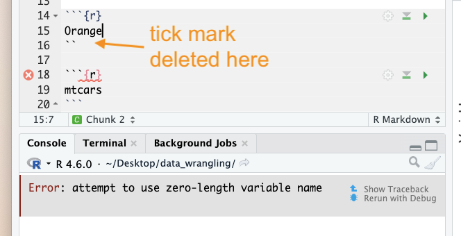
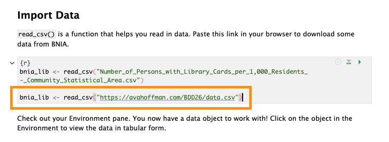

The following are very common new user errors. More can be found on the [Data Science for Environmental Health Error FAQ page](https://daseh.org/help.html).

## RTools

Many core Tidyverse packages (such as `dplyr` and `readr`) outsource computationally and memory-intensive tasks to C++. This makes things faster but unfortunately, requires some additional software. This is where Rtools comes in. Not all packages need it; just the ones that use C, C++ or Fortran code. 

If you get an error like this, it means you still need to install it.

```
*WARNING: Rtools is required to build R packages but is not currently installed. 
Please download and install the appropriate version of Rtools before proceeding:
https://cran.rstudio.com/bin/windows/Rtools/
```

1. Download the [Rtools45 installer](https://cran.r-project.org/bin/windows/Rtools/rtools45/files/rtools45-6768-6492.exe)
2. Find the file that just downloaded
3. Double click to start installation
4. Close and reopen RStudio

:::{.callout-note}
If running an older version of R, you might need to choose from the [different versions of Rtools](https://cran.r-project.org/bin/windows/Rtools/).
:::

## Error: attempt to use zero-length variable name

Usually, this means that a code chunk inside an `.Rmd` file was messed up. Example with a tick mark deleted:

```{r, out.width = "80%", echo = FALSE}

```

## Issues reading/finding data

If you are really struggling to find data on your machine, or are not able to set up an R Project correctly, you can alternatively read data in directly from my website using a url:

`bnia_lib <- read_csv("https://avahoffman.com/BDD26/data.csv")`

```{r, out.width = "80%", echo = FALSE}

```
