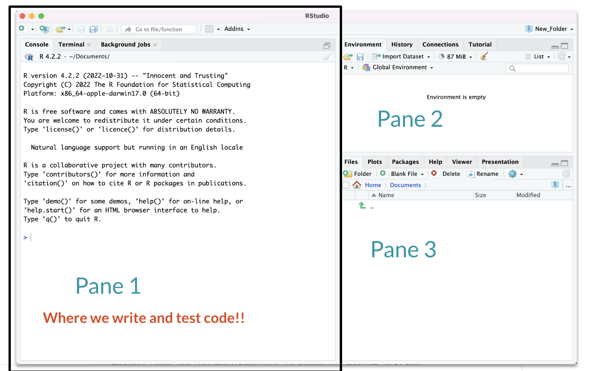
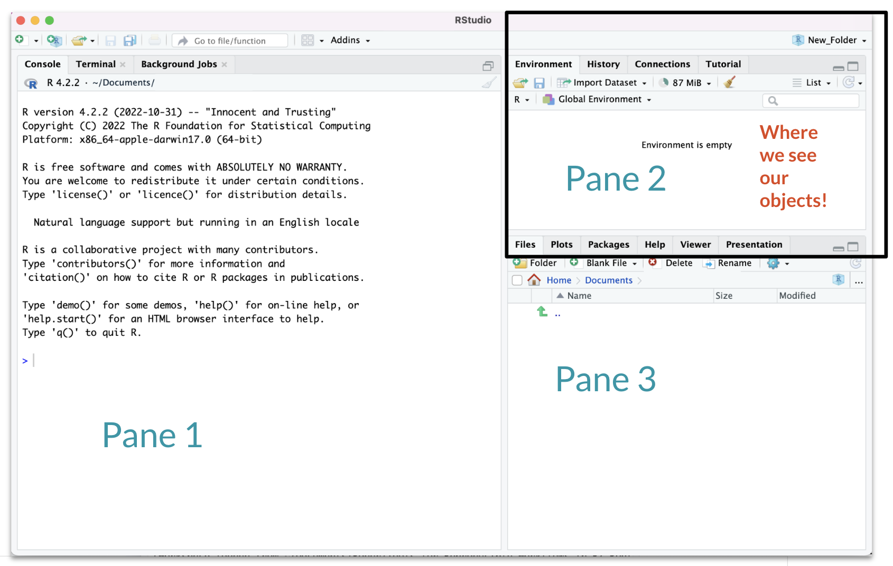

This activity is meant to guide you through some R fundamentals so you can get started on your data journey!

## Installing R and RStudio

You will need to install R. RStudio is a development environment for running R. It comes with a lot of cool features. 

- [Download and Install R](http://cran.us.r-project.org/).
- [Download and Install RStudio](https://posit.co/download/rstudio-desktop/).

If you work on a Windows machine, you might also need to install [R Tools](https://cran.r-project.org/bin/windows/Rtools/). 

## Navigate RStudio

Locate the following in RStudio:

- **Console**. This is where code is run.
- **Environment**. This shows you objects R can work with.

```{r, out.width = "60%", echo = FALSE}

```

```{r, out.width = "60%", echo = FALSE}

```

Read more about the RStudio user interface [here](https://docs.posit.co/ide/user/ide/guide/ui/ui-panes.html).

## Organize your files

We will create an "R Project" to stay organized. You can create many more later.

- Go to File > New Project...
- Select "New Directory".
- Select "New Project".
- Provide a Directory name, such as "Intro to R".
- Pick a reasonable location, such as your Documents folder.

## Intro to R Activity

Now we will transition to the activities, which are actually in the code files!

- Download [This file](https://www.avahoffman.com/BDD26/BDD.Rmd).
- Download [This BNIA data about library cards](https://www.avahoffman.com/BDD26/Number_of_Persons_with_Library_Cards_per_1,000_Residents_-_Community_Statistical_Area.csv).  [(source)](https://vital-signs-bniajfi.hub.arcgis.com/datasets/bniajfi::number-of-persons-with-library-cards-per-1000-residents-1/explore?layer=0&location=39.309794%2C-76.594879%2C13.82)
- Move the downloaded files to the directory you created above.
- Open `BDD.Rmd` in RStudio (File > Open File or simply double-click).
